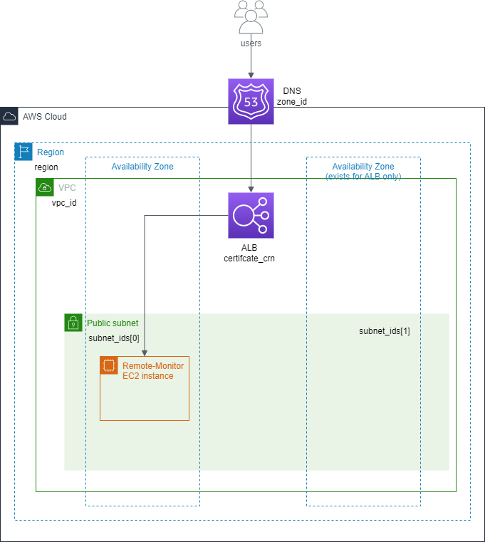

<!-- Copyright 2024-2025 Audinate Pty Ltd and/or its licensors -->

# Remote Monitor Example

This example illustrates how to deploy Remote Monitor. In the example, an application load balancer(ALB) is used to support the HTTPS server that runs in the Remote Monitor instance. It requires at least two available zones, one certificate crn, and one DNS zone id.



## Usage

To run this example you need to execute:

```bash
$ terraform init
$ terraform plan
$ terraform apply
```

Note that this example may create resources which cost money. Run `terraform destroy` when you don't need these resources.

<!-- BEGIN_TF_DOCS -->
## Requirements

| Name | Version |
|------|---------|
| <a name="requirement_terraform"></a> [terraform](#requirement\_terraform) | >= 1.3.7 |
| <a name="requirement_aws"></a> [aws](#requirement\_aws) | ~> 4.0 |

## Modules

| Name | Source | Version |
|------|--------|---------|
| <a name="module_remote-monitor"></a> [remote-monitor](#module\_remote-monitor) | ../../modules/remote-monitor | n/a |

## Resources

| Name | Type |
|------|------|
| [aws_route53_record.remote_monitor_cname_route53_record](https://registry.terraform.io/providers/hashicorp/aws/latest/docs/resources/route53_record) | resource |

## Inputs

| Name | Description | Type | Default | Required |
|------|-------------|------|---------|:--------:|
| <a name="input_certificate_arn"></a> [certificate\_arn](#input\_certificate\_arn) | The certificate ARN to associate with the application load balancer | `string` | n/a | yes |
| <a name="input_region"></a> [region](#input\_region) | Region the instances will be created in | `string` | n/a | yes |
| <a name="input_rm_version"></a> [rm\_version](#input\_rm\_version) | (Optional) The version of Remote Monitor to be installed | `string` | `null` | no |
| <a name="input_subnet_ids"></a> [subnet\_ids](#input\_subnet\_ids) | The list of VPC Subnet IDs the instances will be launched in | `list(string)` | n/a | yes |
| <a name="input_vpc_id"></a> [vpc\_id](#input\_vpc\_id) | The VPC ID the instances will be created in | `string` | n/a | yes |
| <a name="input_web_admin_email"></a> [web\_admin\_email](#input\_web\_admin\_email) | The admin email address to log in to Remote Monitor | `string` | n/a | yes |
| <a name="input_web_admin_password"></a> [web\_admin\_password](#input\_web\_admin\_password) | The admin password to log in to Remote Monitor | `string` | n/a | yes |
| <a name="input_zone_id"></a> [zone\_id](#input\_zone\_id) | The ID of the Route53 hosted zone where the CNAME records of Remote Monitor instances are stored | `string` | n/a | yes |
<!-- END_TF_DOCS -->
